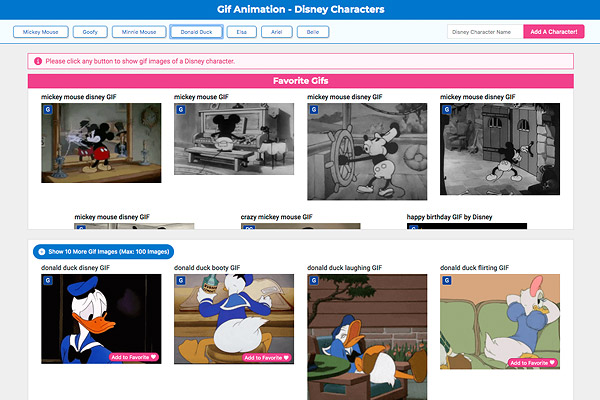

# Gif Tastic

### Overview
Use the GIPHY API to make a dynamic web page that populates with gifs of your choice.

### Tech/framework used

- HTML
- CSS
- JavaScript
- jQuery
- GIPHY API
- localStorage

### API reference
[GIPHY API](https://developers.giphy.com/docs/sdk)

### How to use?
Click any button to show gif images of a Disney character.

You can also add buttons of your choice of character from the "Add A Character" field.

In order to view the actual gif animation, please mouse over an image.

After displaying images, you can save your favorite images by clicking on "Add to Favorite" button of each image.